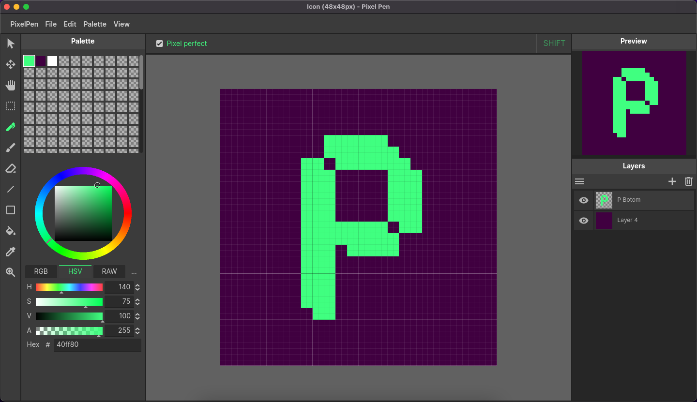

# PixelPen

Pixel Pen is a free and open source pixel art editor, proudly created with the Godot Engine. Pixel Pen can be use as godot addons and standalone aplication

## Download
- [Addons](https://github.com/bayu-sw/pixelpen/releases)

## Licensing

MIT (See copyright file for more informations)

## NOTE

*To use PixelPen as Aplication you can select*
*res://addons/net.yarvis.pixel_pen/editor/editor_main_ui.tscn*
*as your main scene and export the project for your prefered platform.*